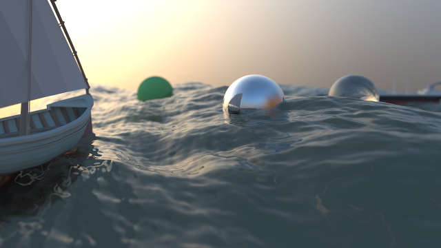

omochi-renderer
==========

※English follows after Japanese.

## Overview
レイトレ合宿2!!に提出したレンダラです。
https://sites.google.com/site/raytracingcamp2/

Uni-directional なパストレーサです。

## Result
実際に合宿でレンダリングした結果は以下のような画像です（フルサイズはレイトレ合宿のサイトで見てください）。

## Build
* OS: Windows Vista 以降
* 開発環境: Visual Studio 2013
* ビルド構成: Win32 (x64はダメ)

以上の環境で、omochi-renderer.sln を開き、Win32のビルド構成でビルドを行えばビルドは通るはずです。

x64だと、ビルドは通りますが正しく動きません（各種型のサイズを32bit前提で作っていたため）

## Run
### Before Running
glewを利用しているので、実行ファイルと同じディレクトリにglew32.dllを置いてください。

後はexeを叩くだけで実行できます。

### Settings＆Input Data
ルートディレクトリの settings.txt を編集する事で、読み込むシーン、カメラの設定等を編集できます。

シーンに配置するデータは、input_data内に置かれています（一部、容量等の問題からリポジトリに追加していません）

## Related Documents
本レンダラにどのような技術を用いたかの簡単な説明は、合宿の際に行ったショートプレゼンの資料と、後記をご覧下さい。

* http://www.slideshare.net/omochi64/2-38791926
* http://qiita.com/omochi64/items/9ecc666f6cb4765443fb

レイトレ合宿2!! アドベントカレンダーで書いた記事です。

* Bounding Volume Hierarchy (BVH) の実装 - 構築編: http://qiita.com/omochi64/items/9336f57118ba918f82ec
* Bounding Volume Hierarchy (BVH) の実装 - 交差判定編: http://qiita.com/omochi64/items/c2bbe92d707b280896fd

本レンダラは、hole氏が公開しているeduptを多いに参考にして書かれています。

詳細なコメント付きソース、技術解説に関してはeduptを見ましょう。

* http://kagamin.net/hole/edupt/
* http://kagamin.net/hole/edubpt/ (こちらはBi-directional PTを実装した edubpt)

==========

In English

## Overview
This is a renderer which is submited to "Raytracing Camp 2!!".
https://sites.google.com/site/raytracingcamp2/

This renderer is an uni-directional pathtracer.

## Result
The result that the renderer output in the camp (see the full size image on the camp's site).

## Build
* OS: Windows Vista or later version
* Visual Studio 2013
* Build Target: Win32 (x64 is not supported)

Open omochi-renderer.sln by Visual Studio and run Build for Win32 build target.

With x64 build target, build will success but it won't work well.

## Run
### Before Running
Put glew32.dll into the directory that the renderer .exe exists, and run the exe.

### Settings＆Input Data
You can change a scene, camera settings, output settings and other settings by editing settings.txt.

The data to be set to a scene is in input_data directory (some of data are not placed in repository because of disk capacity).

## Related Documents
Simple explanations about this renderer (only Japanse):
* http://www.slideshare.net/omochi64/2-38791926                                                |Simple explanations about this renderer:
* http://qiita.com/omochi64/items/9ecc666f6cb4765443fb 

My articles I wrote in Raytracing Camp 2!!'s advent calendar (only Japanse):
* Bounding Volume Hierarchy (BVH) の実装 - 構築編: http://qiita.com/omochi64/items/9336f57118ba918f82ec
* Bounding Volume Hierarchy (BVH) の実装 - 交差判定編: http://qiita.com/omochi64/items/c2bbe92d707b280896fd

This renderer is very inspired by "edupt" by hole.
Many parts of this renderer refer it. 
See edupt's source code and slides!!
* http://kagamin.net/hole/edupt/
* http://kagamin.net/hole/edubpt/ (Bi-directional PT version edupt: "edubpt")
